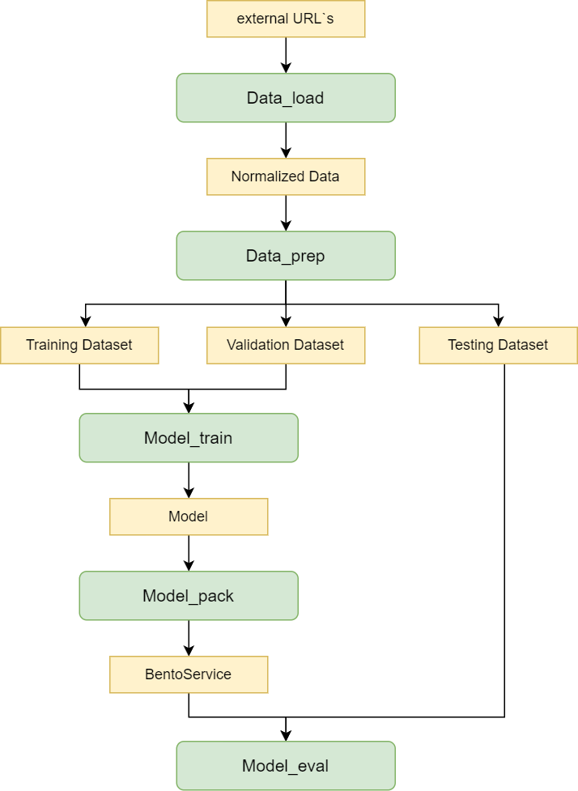

# Rest CV-Pipeline 

A CV or ML Pipeline is a sequence of steps that are performed to process data and train a machine learning model.    
The main purpose of the CV&ML Pipeline is to automate and standardize the data processing and model training process. Pipeline includes various stages such as data preprocessing, feature extraction, model training, performance evaluation, etc. At the same time, each step in the pipeline can be configured and optimized independently of the others, which makes the pipeline flexible and scalable. This allows you to effectively manage the entire process - automate and standardize the process of data processing and model training. It also contributes to the repeatability and reproducibility of results, which is an important aspect in machine learning.

The Rest CV Pipeline is a scenario in which it is required to transfer the model trained in the PyTorch framework in its original form pscked in a docker image with REST API. In this example, the YOLOX_S model from mmdetection is further trained on a part of the COCO dataset validation sample.   

This scenario uses the mmdetection framework, which provides an implementation of various computer vision algorithms, including YOLOX_S. The original YOLOX_S model has already been trained on the full COCO dataset, however, in order to further improve its performance and adapt to specific requirements, additional training is being conducted on a part of the COCO validation sample.    

To retrain the model, a part of the COCO validation sample is used, which is a subset of the data from the full dataset. This reduces the amount of data and speeds up the learning process. As a result of further training, the model will be better adapted to specific tasks and data, which will lead to increased accuracy and performance.  

<div align="center">
  
  <div>&nbsp;</div>
  <div align="center">
    <b><font size="3">Structure Rest CV-Pipeline</font></b>
  </div>
  <div>&nbsp;</div>
</div>

# Description of step Rest CV-Pipeline
## **Data_collection**
### Component logic:


## **Data_load**
### Component logic:
Data_Load is a component of the CV Pipeline, which is responsible for uploading data to the analytical repository. It performs two main functions: uploading external raw data to the platform to convert it into the correct versioned storage structure.    
When uploading data, CV Pipeline extracts this data and prepares it for further processing. This includes converting data formats, converting markup.    
In addition, CV Pipeline also allows you to upload external raw data to the platform. This data can be obtained from various sources, such as files, databases, or APIs. After the CV is loaded, Pipeline converts this data into the correct storage structure, taking into account the versioning requirements. This ensures that the data is saved and available for later analysis and use.      
In general, CV Pipeline plays an important role in the data processing process, ensuring that it is properly loaded and converted into a versioned analytical storage structure. This allows effective data management and provides a reliable basis for subsequent analysis and use of information.
### Interface (input, output):
- Input:
Raw data: different sources, different annotations, external sources
- Output:
Normalized data: with the correct structure for storage in the repository
_____________________________________________
## **Data_prep**
### Component logic:
At the CV Pipeline Data_Prep stage, the data is carefully analyzed and processed to ensure its quality and suitability for future use. The following steps are performed in this process:    
1. Validation: The dataset is checked for errors or inconsistencies. For example, it checks whether there are negative coordinates or omissions in the markup. If such problems are found, they are fixed or deleted.    
2. Markup conversion: If the data markup requires changes or additions, it is converted accordingly. For example, you may need to reclassify objects or add new labels.    
3. Separation of samples: The data set is divided into separate subsets: training, validation and testing datasets. The training set is used to train the model, the validation set is used to set up hyperparameters and evaluate the performance of the model during training, and the test set is used for the final evaluation of the model after training.     
4. Data viewing and processing: Visual data analysis allows you to get an idea of the characteristics of a dataset. For example, class distribution histograms are built to assess class balance and identify possible problems. It may also be useful to consider visual markup examples to better understand the data and possible challenges when training the model.     
### Interface (input, output):
- Input:
Normalized data (obtained from the previous step CV Pipeline - Data_Load)
- Output:
Correct data (data that is suitable for training and testing the trained model)
_____________________________________________
## **Model_train**
### Component logic:
At this stage, the model is trained using the training and validation datasets created at the data_prep component stage.    
To transfer to the following components, weights from the last epoch and the epoch with the best metric are copied. We also copy one of the images of the validation dataset to the directory with the trained model for subsequent tests.    
### Interface (input, output):
- Input:
Training and validation datasets (obtained from the previous step CV Pipeline - Data_Prep)    
Model learning parameters (number of epochs, learning rate, batch size, etc.)   
- Output:
A model in the Pytorch format (weights from the last epoch of learning and with the best metrics)  
_____________________________________________
## **Model_pack**
### Component logic:
At the CV Pipeline Model_Pack stage, the following steps occur:    
1. Model conversion    
- The model trained at the previous stage of the CV-Pipeline Model_Train is converted to a format corresponding to certain scenarios. For example, if the CV-Pipeline REST script is selected, the model can be converted to ONIX format, which provides the ability to deploy the model as a REST service.
2. Packaging in bertoservice    
After converting the model, the model weights and all necessary artifacts (for example, the test image, the predicates of the test image) are packaged in bentoservice. Packaging in bentoservice allows you to create a containerized application that can be easily deployed and used for inference (prediction) on new data.    
### Interface (input, output):
- Input:
Model (obtained from the previous step CV Pipeline - Model_Train)
- Output:
The BentoService model
_____________________________________________
## **Model_eval**
### Component logic:
This stage of the CV Pipeline Model_Eval provides testing of the model, evaluating its performance, saving predicates for further analysis, and visualizing the results using metrics and graphs.   
### Interface (input, output):
- Input:
Test dataset (obtained from the CV Pipeline - Data_Prep step)    
The model in Bertoservice (obtained from the previous step CV Pipeline - Model_Pack)    
- Output:
Model Quality Report
_____________________________________________
_____________________________________________
# Step CV-Pipeline: data_load

This component of the CV (computer vision) pipeline is responsible for loading data from various sources. This component ensures the receipt and preparation of data for further processing and analysis.
Includes the following steps:
- Data Source Selection: This step involves selecting the source from which the data needs to be loaded.
Sources can be image or video files.
- Receiving Data: Once a source is selected, operations are performed to retrieve data from the selected source.
For example, for image or video files, this could be an operation of copying files from disk or loading a dataset from an external source.
- Data conversion. At this stage, data is converted from a non-standard format to the standard format of the SinaraML platform
- Transferring data to the next step of the pipeline: After loading and preparing the data, this stage of the cv pipeline transfers it to the next step of the pipeline, which includes other operations of analysis, processing and preparation of data for training.

In this example, it loads the dataset [`COCO`](http://images.cocodataset.org/).   
To launch and run cv-pipeline faster, we use the validation part of the dataset (~1 GB)
http://images.cocodataset.org/zips/val2017.zip
and annotations to them http://images.cocodataset.org/annotations/annotations_trainval2017.zip          
   
The output of this step CV-Pipeline is two external storage urls
- **coco_datasets_images**     
images of the downloaded dataset
- **coco_datasets_annotations**    
annotation files of the downloaded dataset
- **yolox_pth_pretrain_weights**
pretrain weights

## How to run a step CV-Pipeline: data_load

### Create a directory for the project (or use an existing one)
```
mkdir obj_detect_binary
cd obj_detect_binary
```  

### clone the repository: data_load
```
git clone --recurse-submodules https://github.com/4-DS/obj_detect_rest-data_load.git {dir_for_data_load}
cd {dir_for_data_load}
```  

### run step CV-Pipeline:data_load in dev mode and then in prod mode
```
python step.dev.py
python step.prod.py
``` 